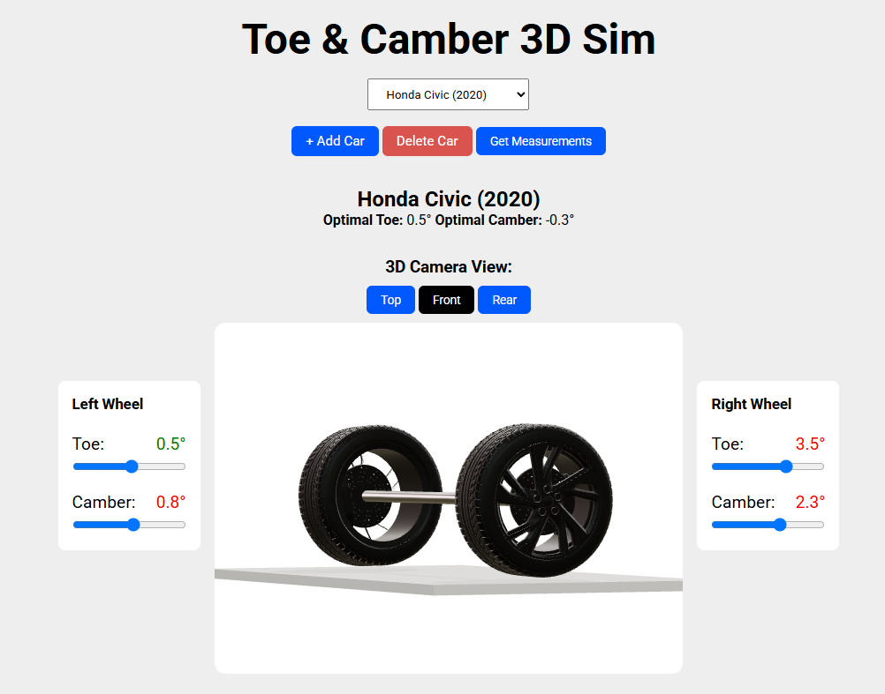

# Car Toe & Camber 3D Alignment Simulator

A minimal .NET 9 minimal‐API + React/Vite + Three.js 3D toe & camber front wheel alignment simulator.



## To use

- Select a car, click **Get Measurements** to get random measuring values, then tweak the toe & camber sliders.
- Green/orange/red feedback shows how far off you are from the optimal values.
- Switch between 3D camera views or rotate manually (click and drag within canvas).
- Add and delete cars.

---

## Prerequisites

- [.NET 9 SDK](https://dotnet.microsoft.com/download)
- [Node.js & npm](https://nodejs.org)

---

## Install & Run

```bash
git clone https://github.com/your-username/car-alignment-sim.git
```

### Run the minimal API

```bash
cd sim/CarsApi
dotnet run
```

### Run the React frontend (second terminal)

```bash
cd 3DToeCamberSim/CarAlignmentSim
npm install
npm run dev
```

### Run the backend tests

```bash
cd 3DToeCamberSim/CarsApi.Tests
dotnet test
```

### Ports

The ports have been forced in the project. If you need to modify these.

- Go to 3DToeCamberSim/CarsApi/Program.cs → line 6
- Go to 3DToeCamberSim/CarAlignmentSim/.env → line 1
